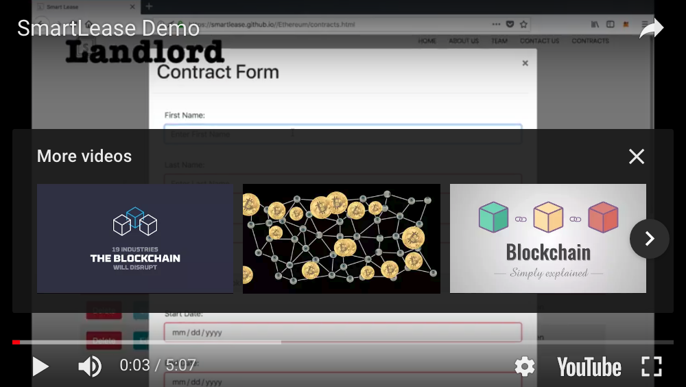

[](https://snyk.io/test/github/SmartLease/Ethereum)

# Smart Lease

<p align="center"></p>

## Welcome
Our SmartLease project will stipulate the minimum components of an Ethereum smart contract for Property leases between Landlords and Tenants.

## Demo
[](https://www.youtube.com/watch?v=J70sqNdYr-Q "Demo")

## Table of Contents
* [Requirements](#requirements)
* [Installation](#installation)
* [Usage](#usage)
* [Credits](#credits)
* [License](#license)

## Requirements
* Ubuntu (v14.04 LTS)
* Solidity (v0.4.21): language used to program smart contracts
* Node: Javascript interpreter
* NPM, Yarn: package management
* Truffle: smart contract management and deployment
* MetaMask: Address and private key management for Ethereum
* Gananche: Local, private test blockchain
* Geth: Go-ethereum client
* Ropsten: Public ethereum test network
* Browserify: package node libraries for use on the web
* Web3js (v1.0): javascript library to wrap JSON-RPC calls to Ethereum
* Javascript

## Installation

0. Install Nodejs, NPM, Docker, MetaMask (for Chrome or Firefox)
1. `git clone https://github.com/SmartLease/Ethereum.git`
2. `$ truffle develop`
3. `truffle(develop)$ compile --all`
4. `truffle(develop)$ migrate --reset`
5. `$ docker run -dit --name smartlease --mount type=bind,src="${pwd}"/docs,dst=/usr/share/nginx/html,ro -p 8080:80 nginx:latest`
6. In your browser, unlock MetaMask (save your secret words!)
7. Go to: `localhost:8080`
8. Import your accounts from Truffle `develop` using their private keys to have access to the ether (not real Ether)
9. Enjoy!

```
```

## Usage
Open the [SmartLease](https://smartlease.github.io/Ethereum/) webpage in a browser,
(https://smartlease.github.io/Ethereum/)

## Credits
SmartLease is owned and maintained by

Andrew Birnbera ([@birnbera](https://twitter.com/birnbera))

Holden Grissett ([@holdengs](https://twitter.com/holdengs))

Felicia Hsieh ([@feliciahsiehsw](https://twitter.com/feliciahsiehsw))

Wendy Segura ([@wendysegura](https://twitter.com/wendysegura))

Tope Agboola ([@topea_](https://twitter.com/topea_))

You can reply to us and to [@holbertonschool](https://twitter.com/holbertonschool) on Twitter for more updates on this project & our forked projects.

## License
SmartLease is released under the MIT license.
